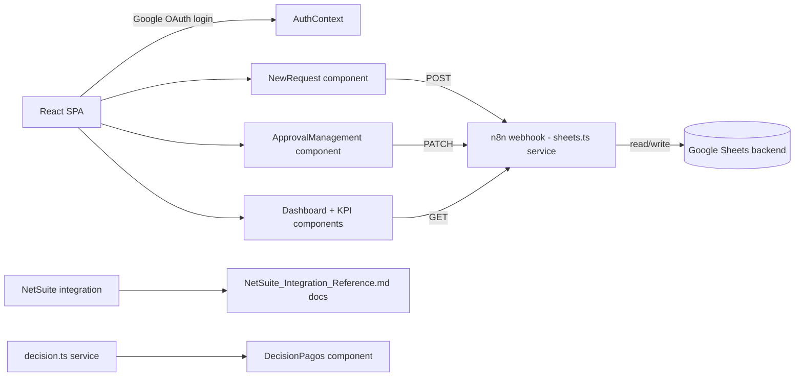

# CLAUDE.md - Gestion de Pagos

## Purpose
React/TypeScript SPA for payment request management: employees submit payment requests, finance team approves/rejects them, with role-based access (requester vs finance vs admin), exchange rate tracking, and NetSuite integration for payment processing.

## Status
- **Phase:** Active Development
- **Last audited:** 2026-07-15
- **Last modified:** 2026-07-15
- **Owner:** Emiliano / Enlight TECH

## Architecture

## Files & Responsibilities
| File | Type | Purpose |
|------|------|---------|
| src/App.tsx | React | Root app, OAuth provider, view routing |
| src/context/AuthContext.tsx | React | Google OAuth + role management |
| src/services/sheets.ts | TS | API calls to n8n/Sheets backend (fetchRequests, createRequest, etc.) |
| src/services/decision.ts | TS | Decision logic for payment approval |
| src/components/Dashboard.tsx | React | KPI dashboard view |
| src/components/ApprovalManagement.tsx | React | Finance approval queue |
| src/components/NewRequest.tsx | React | New payment request form |
| src/components/RequestExplorer.tsx | React | Request search/browse (also renders "Mis solicitudes" in `mode="mine"`) |
| src/components/FinanceManagement.tsx | React | Finanzas queue (Programar Pago / Marcar Pagado) |
| src/components/DecisionPagos.tsx | React | Admin/superadmin decision queue (Aprobar/Aclaración/Rechazar) |
| src/components/Sidebar.tsx | React | Nav visibility per role |
| src/components/WorkflowTracker.tsx | React | Per-request status stepper, includes `Payment Approved` stage |
| src/components/LoginScreen.tsx | React | Google OAuth login screen |
| src/components/RoleGate.tsx | React | Role-based component visibility |
| src/data/mockData.ts | TS | Mock data for development/testing |
| .env | Config | Google Client ID + n8n webhook base URL (gitignored, not committed) |
| public/uploads/decision_pagos.html | HTML | Decision payment reference page |
| n8n-exports/ | JSON (gitignored) | Local copies of live n8n workflows (`workflow-PortalDePagos.json`, `workflow-PortalDecisionPagos.json`, `workflow-stylemailreference.json`) — may embed API tokens, never committed |

## External Dependencies
| System | How connected | Credential location |
|--------|---------------|---------------------|
| Google OAuth | @react-oauth/google, Client ID in .env | .env (gitignored, never committed) |
| n8n webhooks | sheets.ts service layer | VITE_N8N_WEBHOOK_BASE in .env |
| Google Sheets | Via n8n workflow backend (`Portal de Pagos` workflow, sheet MZ-FIN-08 "Pagos Operaciones") | n8n credentials store |
| NetSuite | Reference docs present; gates "Marcar Pagado" in Finanzas | n8n Code nodes ("n8n API" integration credential, rotated 2026-07-14) |

## Design System Compliance
- Fonts: Alexandria + Albert Sans self-hosted in src/assets/fonts/ - DS COMPLIANT.
- Colors: Uses CSS custom properties matching brand tokens.
- Component architecture appropriate for a production React app.

## Key Technical Decisions
1. Google Sheets as backend via n8n - avoids dedicated database for MVP, but has scaling ceiling.
2. Role-based access via RoleGate component + AuthContext.
3. Mock data in mockData.ts - allows development without live API.

## Known Issues / Tech Debt
1. Google Sheets as backend will hit scaling limits at moderate request volume - plan migration to proper DB.
2. NetSuite integration scope unclear from code alone - reference docs exist but "Marcar Pagado" gating is the only confirmed live use; broader integration may not be implemented.
3. mockData.ts in src/ - ensure not loaded in production build.
4. `NetSuite_Integration_Reference.md` (§ around line 358) still references the old `public/n8n/` export path — stale since the 2026-07-15 move to `n8n-exports/`; update next time that doc is touched.
5. Per-role sidebar visibility (matrix below) has not yet been re-verified live per-role by Emiliano — confirmed only in code (Sidebar.tsx/App.tsx RoleGates), not by walking through each role in the browser.
6. "Marcar Pagado" and the "Rechazar" email have not been tested live end-to-end — Marcar Pagado needs an OC with a paid bill in NetSuite to trigger; blocks full confidence in the Finanzas happy path.

## Approval Flow (confirmed with Emiliano 2026-07-14/15 — no routing by project type)
1. Requester submits (`Autorización`) → email to MAC-Dirección roster (`roles=mac,operaciones,ingenieria,servicios`), sent from `postSolicitudes`.
2. MAC-Dirección authorizes in **Aprobaciones** (`Autorización → Pending Fin`) → email to admins ("pendiente de decisión en Decisión de Pagos").
3. **Admin/superadmin decide in Decisión de Pagos** — single-step per-card + bulk actions via `PATCH /solicitudes/status`: Aprobar (`Pending Fin → Payment Approved`, straight to the accountant), Aclaración (`→ Draft` + comment, emails requester and returns to their queue), Rechazar. Legacy `Approved` rows get the same buttons. `analista_contable` has read-only access there.
4. **Requester resubmits after aclaración** (`Draft → Autorización` via `patchStatus`) → MAC-Dirección roster gets a re-envío notification including the requester's clarification response (see Email Notifications).
5. **Analista in Finanzas** works the `Payment Approved` queue: Programar Pago (sets `estimatedPaymentDate` → "Pago Programado" column + email to requester with the date), Marcar Pagado (NetSuite-gated) → `Paid`, plus Rechazar/Aclaración. Superadmin sees the same view with tabs (incl. Pago Aprobado). The intermediate `Approved` status is no longer produced by the UI (legacy rows still accept Programar Pago).

Live-tested end-to-end (2026-07-15, single user): submit → MAC email → aclaración (email + badge + "Requieren tu acción" counter + resubmit with response persisted) → re-authorize (re-envío email) → approve → programar pago (email with date). Not yet tested: per-role sidebar visibility, Marcar Pagado, Rechazar email.

### View visibility matrix (confirmed 2026-07-15, in Sidebar.tsx + App.tsx RoleGates)
- Panel general: mac/operaciones/ingenieria/servicios + admin + superadmin
- Nueva solicitud / Mis solicitudes / Tipo de cambio / Configuración: everyone
- Aprobaciones: mac/operaciones/ingenieria/servicios + superadmin (admin removed)
- Finanzas: analista_contable + superadmin (admin removed)
- Decisión de Pagos / Explorador: admin + analista_contable + superadmin
- "Mis solicitudes" renders `RequestExplorer` with `mode="mine"`: personal summary cards, Concepto + Pago programado columns, plain-language status hint (STATUS_DESC) in the side panel; WorkflowTracker now includes the `Payment Approved` stage (legacy `Approved` maps to it).
- Decisión de Pagos loads progressively: pagos-data/tipo-cambio render immediately, the slow oc-data (NetSuite) + forecast-data cross-reference merges in after ("Cruzando OC/pronóstico…" indicator); silent auto-refresh every 5 min and after each decision.

## Email Notifications (n8n-side, no frontend changes)
Status transitions trigger Gmail emails from inside the existing n8n workflows (no polling/sockets/new frontend deps) — see `NetSuite_Integration_Reference.md` §4.8 for full detail. All email logic below is live in n8n cloud (egenlight.app.n8n.cloud) as of 2026-07-15.
- All emails use the shared Enlight template (gradient header + logo + jade title, white card body, data table, TECH footer) — same visual language as Formulario EPP's emails. The HTML lives in 3 Code nodes of `Portal de Pagos`: `Build email HTML - Solicitud`, `Preparar notificacion pago`, `Preparar notificacion estado`.
- `GET /webhook/roster?roles=a,b` returns emails for given role(s) from the `Roles Portal Pagos` sheet (reverse of the existing `/webhook/role` email→role lookup).
- `postSolicitudes`, `patchStatus`, `patchFinanzas` workflows — each extended with a confirmation email to the requester + (where applicable) a notification email to the next role in the flow.
- Aclaración round-trip: GET `/solicitudes` returns `rejectReason`/`clarificationRequest`/`clarificationResponse` so the "Aclaración" badge and resubmit panel survive a page reload; `patchStatus` writes the real column name "Respuesta a la aclaración"; `Preparar notificacion estado` emails the requester "Tu solicitud requiere aclaración" (yellow comment box + instructions) on `Draft` + clarificationRequest.
- `isAclaracion` in `Preparar notificacion estado` was fixed to a real boolean (`status === 'Draft' && !!clarificationRequest`) — previously a string/boolean mismatch crashed the downstream IF - Notificar node.
- Re-envío after aclaración: when a request returns to `Autorización` via `patchStatus` (only happens on requester resubmit; initial submissions notify from `postSolicitudes`), `Preparar notificacion estado` now sends "Solicitud re-enviada tras aclaración — {id}" to the MAC-Dirección roster with the requester's clarificationResponse in a green box. Previously this transition sent nothing.
- `patchFinanzas` (`estimatedPaymentDate` → "Pago Programado" column, upsert mapping, returned by GET `/solicitudes`): `Preparar notificacion pago` sends "Tu pago fue programado — {id}" to the requester (and keeps the "pago realizado" email on `Paid`); Gmail node subject is dynamic (`{{ $json.subject }}`).
- `patchFinanzas` node order was rewired to be strictly sequential: `Webhook - PATCH Finanzas → Code in JavaScript2 → Append or update row in sheet1 → Obtener solicitud original → Preparar notificacion pago → IF - Notificar Pago → Gmail`. Previously `Obtener solicitud original` ran as a parallel branch off the webhook, racing the sheet upsert and intermittently causing "Node hasn't been executed" in `Preparar notificacion pago`, breaking both the pago-programado and pago-realizado emails. The lookup now reads the id via `$('Webhook - PATCH Finanzas').first().json.body.id` and fetches the row only after the upsert, so emails reflect fresh data.
- Notification routing (see Approval Flow): submission → `roles=mac,operaciones,ingenieria,servicios`; `Pending Fin` → `admin,superadmin`; re-envío (`Autorización` via patchStatus) → `roles=mac,operaciones,ingenieria,servicios`; `Payment Approved` → `analista_contable` (roster URL is a dynamic expression on `rosterRoles`); `Rejected`/approval confirmations → requester. In `patchStatus` the confirmation and next-role notification branches run in parallel off `Preparar notificacion estado`.
- JSON exports live locally under `n8n-exports/` (moved out of `public/` 2026-07-15 so no build/deploy can ever ship them — they may embed API tokens, which is accepted since the folder is gitignored). Not on GitHub, not in the Vercel deploy. The live workflows in n8n cloud (egenlight.app.n8n.cloud) are the source of truth; changes must be imported there to take effect (all 2026-07-15 fixes above were re-imported and verified live). Never deploy with `vercel` CLI from the local working dir.

## Resolved
- 2026-07-06: Removed stray `gestioon-pagos/` nested git clone (leftover duplicate of this same repo, not part of the Vercel deploy which builds from repo root). Its only tracked content, `decision_pagos.html`, was moved to `public/uploads/decision_pagos.html`; the outdated duplicate `netsuite_integration.md` was dropped in favor of the more complete root-level `NetSuite_Integration_Reference.md`. Real `.env` values (previously only present untracked inside the nested clone) were copied into the root `.env` (gitignored, never committed in either location — the prior "exposed credentials" note was inaccurate).
- 2026-07-15: Aclaración round-trip, re-envío notification, and `patchFinanzas` race condition (see Email Notifications) fixed, re-imported to n8n cloud, and live-tested end-to-end for the happy path.

## Agent Routing
- Frontend/React tasks -> @agent-html
- NetSuite tasks -> @agent-netsuite
- n8n tasks -> @agent-n8n
