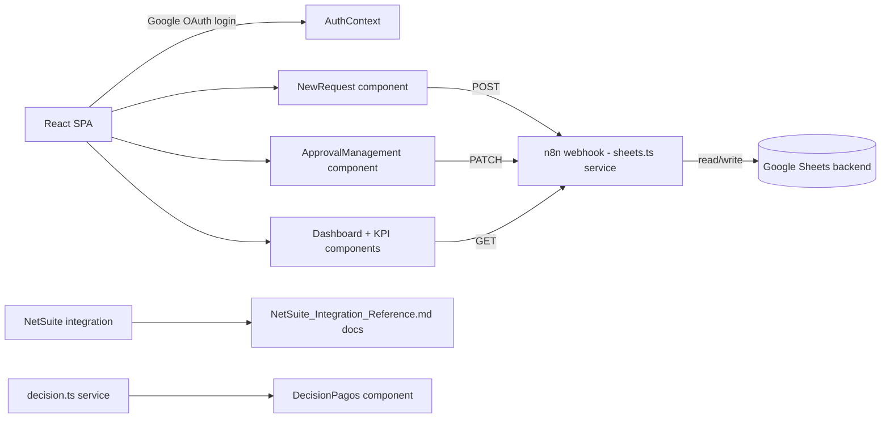

# CLAUDE.md - Gestion de Pagos

## Purpose
React/TypeScript SPA for payment request management: employees submit payment requests, finance team approves/rejects them, with role-based access (requester vs finance vs admin), exchange rate tracking, and NetSuite integration for payment processing.

## Status
- **Phase:** Active Development
- **Last audited:** 2026-07-01
- **Last modified:** 2026-06-30
- **Owner:** Emiliano / Enlight TECH

## Architecture

## Files & Responsibilities
| File | Type | Purpose |
|------|------|---------|
| src/App.tsx | React | Root app, OAuth provider, view routing |
| src/context/AuthContext.tsx | React | Google OAuth + role management |
| src/services/sheets.ts | TS | API calls to n8n/Sheets backend (fetchRequests, createRequest, etc.) |
| src/services/decision.ts | TS | Decision logic for payment approval |
| src/components/Dashboard.tsx | React | KPI dashboard view |
| src/components/ApprovalManagement.tsx | React | Finance approval queue |
| src/components/NewRequest.tsx | React | New payment request form |
| src/components/RequestExplorer.tsx | React | Request search/browse |
| src/components/FinanceManagement.tsx | React | Finance team view |
| src/components/LoginScreen.tsx | React | Google OAuth login screen |
| src/components/RoleGate.tsx | React | Role-based component visibility |
| src/data/mockData.ts | TS | Mock data for development/testing |
| .env | Config | Google Client ID + n8n webhook base URL (gitignored, not committed) |
| public/uploads/decision_pagos.html | HTML | Decision payment reference page |

## External Dependencies
| System | How connected | Credential location |
|--------|---------------|---------------------|
| Google OAuth | @react-oauth/google, Client ID in .env | .env (gitignored, never committed) |
| n8n webhooks | sheets.ts service layer | VITE_N8N_WEBHOOK_BASE in .env |
| Google Sheets | Via n8n workflow backend | n8n credentials store |
| NetSuite | Reference docs present; integration scope unclear | TBD |

## Design System Compliance
- Fonts: Alexandria + Albert Sans self-hosted in src/assets/fonts/ - DS COMPLIANT.
- Colors: Uses CSS custom properties matching brand tokens.
- Component architecture appropriate for a production React app.

## Key Technical Decisions
1. Google Sheets as backend via n8n - avoids dedicated database for MVP, but has scaling ceiling.
2. Role-based access via RoleGate component + AuthContext.
3. Mock data in mockData.ts - allows development without live API.

## Known Issues / Tech Debt
1. Google Sheets as backend will hit scaling limits at moderate request volume - plan migration to proper DB.
2. NetSuite integration scope unclear from code alone - reference docs exist but integration may not be implemented.
3. mockData.ts in src/ - ensure not loaded in production build.
4. ~~Approver routing for the submission-notification email~~ — resolved 2026-07-14: no routing by project type; submission notifies the MAC-Dirección roster (see Approval Flow).

## Approval Flow (confirmed with Emiliano 2026-07-14 — no routing by project type)
1. Requester submits (`Autorización`) → email to MAC-Dirección roster (`roles=mac,operaciones,ingenieria,servicios`).
2. MAC-Dirección authorizes in **Aprobaciones** (`Autorización → Pending Fin`) → email to admins ("pendiente de decisión en Decisión de Pagos").
3. **Admin/superadmin decide in Decisión de Pagos** — single-step per-card + bulk actions via `PATCH /solicitudes/status`: Aprobar (`Pending Fin → Payment Approved`, straight to the accountant), Aclaración (`→ Draft` + comment), Rechazar. Legacy `Approved` rows get the same buttons. `analista_contable` has read-only access there.
4. **Analista in Finanzas** works the `Payment Approved` queue: Programar Pago (sets `estimatedPaymentDate` → "Pago Programado" column + email to requester with the date), Marcar Pagado (NetSuite-gated) → `Paid`, plus Rechazar/Aclaración. Superadmin sees the same view with tabs (incl. Pago Aprobado). The intermediate `Approved` status is no longer produced by the UI (legacy rows still accept Programar Pago).

### View visibility matrix (confirmed 2026-07-15, in Sidebar.tsx + App.tsx RoleGates)
- Panel general: mac/operaciones/ingenieria/servicios + admin + superadmin
- Nueva solicitud / Mis solicitudes / Tipo de cambio / Configuración: everyone
- Aprobaciones: mac/operaciones/ingenieria/servicios + superadmin (admin removed)
- Finanzas: analista_contable + superadmin (admin removed)
- Decisión de Pagos / Explorador: admin + analista_contable + superadmin
- "Mis solicitudes" renders `RequestExplorer` with `mode="mine"`: personal summary cards, Concepto + Pago programado columns, plain-language status hint (STATUS_DESC) in the side panel; WorkflowTracker now includes the `Payment Approved` stage (legacy `Approved` maps to it).
- Decisión de Pagos loads progressively: pagos-data/tipo-cambio render immediately, the slow oc-data (NetSuite) + forecast-data cross-reference merges in after ("Cruzando OC/pronóstico…" indicator); silent auto-refresh every 5 min and after each decision.

## Email Notifications (n8n-side, no frontend changes)
Status transitions trigger Gmail emails from inside the existing n8n workflows (no polling/sockets/new frontend deps) — see `NetSuite_Integration_Reference.md` §4.8 for full detail.
- All 5 emails use the shared Enlight template (gradient header + logo + jade title, white card body, data table, TECH footer) — same visual language as Formulario EPP's emails. The HTML lives in 3 Code nodes of `Portal de Pagos`: `Build email HTML - Solicitud`, `Preparar notificacion pago`, `Preparar notificacion estado` (restyled 2026-07-14; went live with the 2026-07-15 import to n8n cloud).
- `GET /webhook/roster?roles=a,b` returns emails for given role(s) from the `Roles Portal Pagos` sheet (reverse of the existing `/webhook/role` email→role lookup).
- `postSolicitudes`, `patchStatus`, `patchFinanzas` workflows — each extended with a confirmation email to the requester + (where applicable) a notification email to Finanzas (`analista_contable`).
- Aclaración round-trip fixed (2026-07-15, local export — pending re-import to n8n cloud): GET `/solicitudes` now returns `rejectReason`/`clarificationRequest`/`clarificationResponse` (before, the frontend never saw them after reload, so the "Aclaración" badge and resubmit panel only worked within the same session); `patchStatus` now writes the real column name "Respuesta a la aclaración" (was "Respuesta a Aclaración" — silently dropped) and its upsert maps the column; `Preparar notificacion estado` emails the requester "Tu solicitud requiere aclaración" (yellow comment box + instructions) on `Draft` + clarificationRequest.
- `patchFinanzas` (2026-07-15, imported to n8n cloud same day): `estimatedPaymentDate` is now persisted (fieldMap → "Pago Programado" column, upsert mapping, and returned by GET `/solicitudes`) — before this it was silently dropped. `Preparar notificacion pago` sends "Tu pago fue programado — {id}" to the requester with the formatted date (and keeps the "pago realizado" email on `Paid`); the Gmail node subject is now dynamic (`{{ $json.subject }}`).
- Notification routing (resolved, see Approval Flow): submission → `roles=mac,operaciones,ingenieria,servicios`; `Pending Fin` → `admin,superadmin`; `Payment Approved` → `analista_contable` (roster URL is a dynamic expression on `rosterRoles`); `Rejected`/approval confirmations → requester. In `patchStatus` the confirmation and next-role notification branches now run in parallel off `Preparar notificacion estado` (before, the notification chain hung off the confirmation Gmail node).
- JSON exports live locally under `public/n8n/` for reference, but the folder is gitignored as of 2026-07-14 — not on GitHub and not part of the Vercel deploy. The live workflows in n8n cloud (egenlight.app.n8n.cloud) are the source of truth; changes must be imported there to take effect.

## Resolved
- 2026-07-06: Removed stray `gestioon-pagos/` nested git clone (leftover duplicate of this same repo, not part of the Vercel deploy which builds from repo root). Its only tracked content, `decision_pagos.html`, was moved to `public/uploads/decision_pagos.html`; the outdated duplicate `netsuite_integration.md` was dropped in favor of the more complete root-level `NetSuite_Integration_Reference.md`. Real `.env` values (previously only present untracked inside the nested clone) were copied into the root `.env` (gitignored, never committed in either location — the prior "exposed credentials" note was inaccurate).

## Agent Routing
- Frontend/React tasks -> @agent-html
- NetSuite tasks -> @agent-netsuite
- n8n tasks -> @agent-n8n
