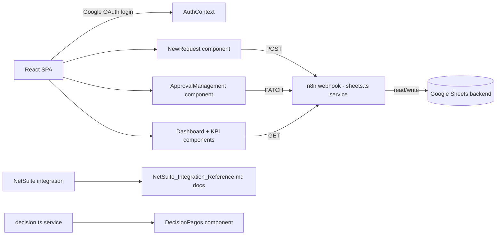

# CLAUDE.md - Gestion de Pagos

## Purpose
React/TypeScript SPA for payment request management: employees submit payment requests, finance team approves/rejects them, with role-based access (requester vs finance vs admin), exchange rate tracking, and NetSuite integration for payment processing.

## Status
- **Phase:** Active Development
- **Last audited:** 2026-07-01
- **Last modified:** 2026-06-30
- **Owner:** Emiliano / Enlight TECH

## Architecture

## Files & Responsibilities
| File | Type | Purpose |
|------|------|---------|
| src/App.tsx | React | Root app, OAuth provider, view routing |
| src/context/AuthContext.tsx | React | Google OAuth + role management |
| src/services/sheets.ts | TS | API calls to n8n/Sheets backend (fetchRequests, createRequest, etc.) |
| src/services/decision.ts | TS | Decision logic for payment approval |
| src/components/Dashboard.tsx | React | KPI dashboard view |
| src/components/ApprovalManagement.tsx | React | Finance approval queue |
| src/components/NewRequest.tsx | React | New payment request form |
| src/components/RequestExplorer.tsx | React | Request search/browse |
| src/components/FinanceManagement.tsx | React | Finance team view |
| src/components/LoginScreen.tsx | React | Google OAuth login screen |
| src/components/RoleGate.tsx | React | Role-based component visibility |
| src/data/mockData.ts | TS | Mock data for development/testing |
| .env | Config | Google Client ID + n8n webhook base URL (gitignored, not committed) |
| public/uploads/decision_pagos.html | HTML | Decision payment reference page |

## External Dependencies
| System | How connected | Credential location |
|--------|---------------|---------------------|
| Google OAuth | @react-oauth/google, Client ID in .env | .env (gitignored, never committed) |
| n8n webhooks | sheets.ts service layer | VITE_N8N_WEBHOOK_BASE in .env |
| Google Sheets | Via n8n workflow backend | n8n credentials store |
| NetSuite | Reference docs present; integration scope unclear | TBD |

## Design System Compliance
- Fonts: Alexandria + Albert Sans self-hosted in src/assets/fonts/ - DS COMPLIANT.
- Colors: Uses CSS custom properties matching brand tokens.
- Component architecture appropriate for a production React app.

## Key Technical Decisions
1. Google Sheets as backend via n8n - avoids dedicated database for MVP, but has scaling ceiling.
2. Role-based access via RoleGate component + AuthContext.
3. Mock data in mockData.ts - allows development without live API.

## Known Issues / Tech Debt
1. Google Sheets as backend will hit scaling limits at moderate request volume - plan migration to proper DB.
2. NetSuite integration scope unclear from code alone - reference docs exist but integration may not be implemented.
3. mockData.ts in src/ - ensure not loaded in production build.

## Resolved
- 2026-07-06: Removed stray `gestioon-pagos/` nested git clone (leftover duplicate of this same repo, not part of the Vercel deploy which builds from repo root). Its only tracked content, `decision_pagos.html`, was moved to `public/uploads/decision_pagos.html`; the outdated duplicate `netsuite_integration.md` was dropped in favor of the more complete root-level `NetSuite_Integration_Reference.md`. Real `.env` values (previously only present untracked inside the nested clone) were copied into the root `.env` (gitignored, never committed in either location — the prior "exposed credentials" note was inaccurate).

## Agent Routing
- Frontend/React tasks -> @agent-html
- NetSuite tasks -> @agent-netsuite
- n8n tasks -> @agent-n8n
