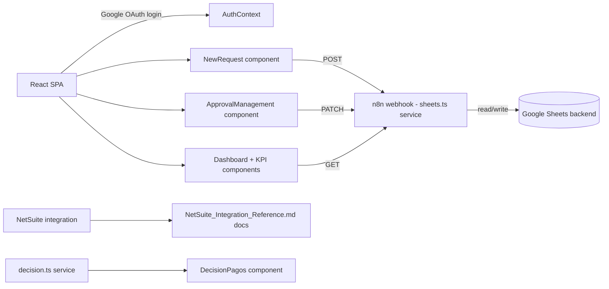

# CLAUDE.md - Gestion de Pagos

## Purpose
React/TypeScript SPA for payment request management: employees submit payment requests, finance team approves/rejects them, with role-based access (requester vs finance vs admin), exchange rate tracking, and NetSuite integration for payment processing.

## Status
- **Phase:** Active Development
- **Last audited:** 2026-07-15
- **Last modified:** 2026-08-27
- **Owner:** Emiliano / Enlight TECH

## Architecture

```mermaid
graph LR
  A[React SPA] -->|Google OAuth login| B[AuthContext]
  A --> C[NewRequest component]
  C -->|POST| D[n8n webhook - sheets.ts service]
  A --> E[ApprovalManagement component]
  E -->|PATCH| D
  A --> F[Dashboard + KPI components]
  F -->|GET| D
  D -->|read/write| G[(Google Sheets backend)]
  H[NetSuite integration] --> I[NetSuite_Integration_Reference.md docs]
  J[decision.ts service] --> K[DecisionPagos component]
```

## Files & Responsibilities
| File | Type | Purpose |
|------|------|---------|
| src/App.tsx | React | Root app, OAuth provider, view routing |
| src/context/AuthContext.tsx | React | Google OAuth + role management |
| src/services/sheets.ts | TS | API calls to n8n/Sheets backend (fetchRequests, createRequest, fetchCecoList, etc.) |
| src/services/decision.ts | TS | Decision logic for payment approval |
| src/components/Dashboard.tsx | React | KPI dashboard view |
| src/components/ApprovalManagement.tsx | React | Finance approval queue |
| src/components/NewRequest.tsx | React | New payment request form; "Departamento solicitante" is a Combobox fed by `fetchCecoList()` (NetSuite CeCo/job records), not free text |
| src/components/RequestExplorer.tsx | React | Request search/browse (also renders "Mis solicitudes" in `mode="mine"`); aclaración panel offers "Solo responder y reenviar" or "Editar solicitud" (edits concept/departamento/monto before resubmitting) — Departamento there is the same CeCo-backed Combobox as NewRequest.tsx |
| src/components/FinanceManagement.tsx | React | Finanzas queue (Programar Pago / Marcar Pagado) |
| src/components/PaymentModal.tsx | React | "Marcar Pagado" modal (single + bulk); every field mandatory; bulk mode has a per-request NetSuite payment-match card (bill/payment selector, Monto Pagado, T/C, Banco, Referencia all sourced from the matched bill, not the request) plus derived-only Propuesta |
| src/components/DecisionPagos.tsx | React | Admin/superadmin decision queue (Aprobar/Aclaración/Rechazar); expanded row fetches the real invoice PDF link (Recepción de Facturas) live per OC |
| src/components/Feed.tsx | React | "Inicio" announcements feed — analista_contable/admin/superadmin can publish (text + optional link); all roles read and can toggle a "like" (Zap icon); marks notifications read on view |
| src/components/TopBar.tsx | React | Bell icon + unread badge, polls unread-count every 90s, dropdown of recent posts, click navigates to Inicio and marks read |
| src/services/posts.ts | TS | API calls for the announcements feed (fetchPosts, createPost, toggleLike, fetchUnreadCount, markNotificationsRead) |
| src/components/Sidebar.tsx | React | Nav visibility per role |
| src/components/Combobox.tsx | React | Reusable searchable dropdown; options support an optional `badge` (e.g. "Ya pagada" on OCs already settled in NetSuite) |
| src/components/WorkflowTracker.tsx | React | Per-request status stepper, includes `Payment Approved` stage |
| src/components/LoginScreen.tsx | React | Google OAuth login screen |
| src/components/RoleGate.tsx | React | Role-based component visibility |
| src/data/mockData.ts | TS | Mock data for development/testing |
| .env | Config | Google Client ID + n8n webhook base URL (gitignored, not committed) |
| public/uploads/decision_pagos.html | HTML | Decision payment reference page |
| n8n-exports/ | JSON (gitignored) | Local copies of live n8n workflows (`workflow-PortalDePagos.json`, `workflow-PortalDecisionPagos.json`, `workflow-stylemailreference.json`) — may embed API tokens, never committed |

## External Dependencies
| System | How connected | Credential location |
|--------|---------------|---------------------|
| Google OAuth | @react-oauth/google, Client ID in .env | .env (gitignored, never committed) |
| n8n webhooks | sheets.ts service layer | VITE_N8N_WEBHOOK_BASE in .env |
| Google Sheets | Via n8n workflow backend (`Portal de Pagos` workflow, sheet MZ-FIN-08 "Pagos Operaciones") | n8n credentials store |
| Recepción de Facturas | Separate Enlight project/n8n workflow (`Ue60gpoPgLoKxWWu`) where suppliers/collaborators upload invoices; `Portal de Pagos`'s `GET /link-factura` reads its "Registros" sheet directly (same Google Sheets credential, `Google Sheets account 3`) to source "Link Factura" | shared n8n credential, no direct integration beyond that one read |
| NetSuite | Reference docs present; gates "Marcar Pagado" in Finanzas | n8n Code nodes ("n8n API" integration credential, rotated 2026-07-14) |

## Design System Compliance
- Fonts: Alexandria + Albert Sans self-hosted in src/assets/fonts/ - DS COMPLIANT.
- Colors: Uses CSS custom properties matching brand tokens.
- Component architecture appropriate for a production React app.

## Key Technical Decisions
1. Google Sheets as backend via n8n - avoids dedicated database for MVP, but has scaling ceiling.
2. Role-based access via RoleGate component + AuthContext.
3. Mock data in mockData.ts - allows development without live API.

## Known Issues / Tech Debt
1. Google Sheets as backend will hit scaling limits at moderate request volume - plan migration to proper DB.
2. NetSuite integration scope unclear from code alone - reference docs exist but "Marcar Pagado" gating is the only confirmed live use; broader integration may not be implemented.
3. mockData.ts in src/ - ensure not loaded in production build.
4. `NetSuite_Integration_Reference.md` (§ around line 358) still references the old `public/n8n/` export path — stale since the 2026-07-15 move to `n8n-exports/`; update next time that doc is touched.
5. Per-role sidebar visibility (matrix below) has not yet been re-verified live per-role by Emiliano — confirmed only in code (Sidebar.tsx/App.tsx RoleGates), not by walking through each role in the browser.
6. "Marcar Pagado" and the "Rechazar" email have not been tested live end-to-end. Live-tested 2026-08-13 up through NetSuite bill/payment matching (see § NetSuite OC/Payment Matching Fixes below); actual "Paid" transition + Rechazar email still unverified.
7. **Partially resolved 2026-08-24** — the OC dropdown's line-level project match + status-code fix (see § NetSuite OC/Payment Matching Fixes) was confirmed **live in the n8n cloud workflow** by pulling `Code: OAuth SuiteQL` directly via the n8n public API on 2026-08-24 (query includes the `cseg_bb_project` line join and `status NOT IN ('A','C','H')`). Still unverified: whether the partial-payment-aware Marcar Pagado gate (`Code: Merge Bills + Payments` returning one row per bill/payment pair) and the "NetSuite Payment ID" sheet column are both live — a single-payment OC checked today didn't exercise the multi-payment-per-bill path, so this remains open until confirmed with a multi-payment bill.
8. **Blocking, added 2026-08-14** — `PaymentModal.tsx`'s "Referencia de Operación" field now auto-prefills (editable) from `NSBill.payment_tranid` (the NetSuite VendPymt transaction number, e.g. `VENDPYMT12895`, confirmed live against payment id 857123 and cross-checked against its NetSuite UI "NÚMERO DE TRANSACCIÓN" field) when a NetSuite payment is matched. The `pagos-por-oc` SuiteQL in `n8n-exports/workflow-PortalDePagos.json` (`Code: Step 3 - Build Payment Query`) selects `t.transactionnumber` (NOT `tranid` — confirmed via direct SuiteQL that `transaction.tranid` is null for VendPymt records on this account; the display number lives in `transactionnumber` instead), joined via `LEFT JOIN transaction t ON t.id = ntll.nextdoc`, and threaded through `Code: Merge Bills + Payments` into each bill/payment row. This is only live in the local mirror — needs re-import to the n8n cloud workflow before the prefill works in production.
9. **Resolved 2026-08-24** — the "Editar solicitud" aclaración path's `concept`/`department`/`subtotal`/`iva`/`amount`/`paymentType` mapping in `patchStatus` was confirmed **live in n8n cloud** (pulled the node directly via the n8n public API); edited resubmits do persist. This same live PATCH endpoint was also used 2026-08-24 to backfill PAY-802's corrupted fields — see § PAY-802 data-loss incident and CeCo dropdown below.
10. Bulk "Marcar Pagado" was significantly reworked 2026-08-18 (see § Bulk "Marcar Pagado" rework) — frontend-only, no n8n dependency, but not yet live-tested with a real multi-request batch.
11. **Added 2026-08-20** — the Announcements Feed (`Feed.tsx`/`TopBar.tsx`, see § Announcements Feed + Notification Center) is live and verified at the n8n/webhook layer (direct curl tests), but has not yet been clicked through in the actual browser UI — verify the composer/like/bell/badge render and behave correctly per role before treating it as done.
12. **Resolved 2026-08-24 — real root cause found and fixed.** The original theory (a frontend bug in `NewRequest.tsx`) was wrong. Confirmed via n8n execution history (`GET /executions`) that `PAY-802`, `PAY-248`, `PAY-390`, `PAY-358` were all created with fully correct `concept`/`subtotal`/`iva`/`amount`/`department` — the data was wiped **afterward**, by every single plain status-only `PATCH /solicitudes/status` call (Aprobar, Pending Fin, Rechazar, etc.) that doesn't itself carry those fields. Root cause: `patchStatus`'s `Append or update row in sheet` node unconditionally maps `Concepto de pago`/`Subtotal`/`IVA`/`Monto Solicitado`/`Departamento solicitante`/`paymentType`/`Motivo de Rechazo`/`Solicitud de Aclaración`/`Respuesta a la aclaración` on *every* invocation (`{{ $json['Concepto de pago'] }}` etc.), while the upstream `Code in JavaScript` node only ever set those keys when the incoming request body explicitly included them (the "Editar solicitud" edit-and-resend path, added 2026-08-18). Any other transition — which is nearly all of them — left those keys absent, the mapped expression evaluated to blank, and the sheet cell got overwritten with an empty string, silently destroying the real value. This was live and actively corrupting real data from the moment the 2026-08-18 "Editar solicitud" feature extended that column mapping. **Fixed 2026-08-24**: `Code in JavaScript` now always sets these keys, falling back to the pre-existing value read by `Get row(s) in sheet` earlier in the same execution (`found["Concepto de pago"] || ""` etc.) whenever the incoming body doesn't explicitly provide a new one — so a plain status change now preserves whatever was already there. Verified live: a no-op status PATCH against `PAY-591` left its `concept`/`amount` untouched afterward. All 5 known-corrupted requests (`PAY-802`, `PAY-248`, `PAY-390`, `PAY-358`, `PAY-347`) were backfilled with their real original values, recovered either from earlier in the same conversation (`PAY-802`, `PAY-347`) or by binary-searching `GET /executions` by timestamp to find each request's original `POST /solicitudes` webhook body (`PAY-248`, `PAY-390`, `PAY-358`) — not guessed. No other requests should be at risk going forward, but any solicitud approved between 2026-08-18 and 2026-08-24 that was never manually checked could theoretically carry the same corruption; worth a one-time sweep of the sheet for blank `Monto Solicitado` on non-Draft rows if time allows.
13. **NetSuite OAuth1 credentials (consumer key/secret, token id/secret) are hardcoded in plaintext inside several `n8n-nodes-base.code` nodes** in the live `Portal de Pagos` workflow (`Code: OAuth SuiteQL`, `Code: OAuth SuiteQL1/2/3`, `Code: Step 3 - Build Payment Query`, `Generar OAuth Signature`, etc.), rather than using n8n's credential store. Flagged to Emiliano 2026-08-24; explicitly deferred for now (not fixed) — anyone with view/edit access to the workflow or an export of it can read the live NetSuite API credentials. Revisit if workflow-sharing/access scope ever changes, or next time these credentials are rotated.

## Approval Flow (confirmed with Emiliano 2026-07-14/15 — no routing by project type)
1. Requester submits (`Autorización`) → email to MAC-Dirección roster (`roles=mac,operaciones,ingenieria,servicios`), sent from `postSolicitudes`.
2. MAC-Dirección authorizes in **Aprobaciones** (`Autorización → Pending Fin`) → email to admins ("pendiente de decisión en Decisión de Pagos").
3. **Admin/superadmin decide in Decisión de Pagos** — single-step per-card + bulk actions via `PATCH /solicitudes/status`: Aprobar (`Pending Fin → Payment Approved`, straight to the accountant), Aclaración (`→ Draft` + comment, emails requester and returns to their queue), Rechazar. Legacy `Approved` rows get the same buttons. `analista_contable` has read-only access there.
4. **Requester resubmits after aclaración** (`Draft → Autorización` via `patchStatus`) → MAC-Dirección roster gets a re-envío notification including the requester's clarification response (see Email Notifications).
5. **Analista in Finanzas** works the `Payment Approved` queue: Programar Pago (sets `estimatedPaymentDate` → "Pago Programado" column + email to requester with the date), Marcar Pagado (NetSuite-gated) → `Paid`, plus Rechazar/Aclaración. Superadmin sees the same view with tabs (incl. Pago Aprobado). The intermediate `Approved` status is no longer produced by the UI (legacy rows still accept Programar Pago).

Live-tested end-to-end (2026-07-15, single user): submit → MAC email → aclaración (email + badge + "Requieren tu acción" counter + resubmit with response persisted) → re-authorize (re-envío email) → approve → programar pago (email with date). Not yet tested: per-role sidebar visibility, Marcar Pagado, Rechazar email.

### View visibility matrix (confirmed 2026-07-15, in Sidebar.tsx + App.tsx RoleGates)
- Panel general: mac/operaciones/ingenieria/servicios + admin + superadmin
- Nueva solicitud / Mis solicitudes / Tipo de cambio / Configuración: everyone
- Aprobaciones: mac/operaciones/ingenieria/servicios + superadmin (admin removed)
- Finanzas: analista_contable + superadmin (admin removed)
- Decisión de Pagos / Explorador: admin + analista_contable + superadmin
- "Mis solicitudes" renders `RequestExplorer` with `mode="mine"`: personal summary cards, Concepto + Pago programado columns, plain-language status hint (STATUS_DESC) in the side panel; WorkflowTracker now includes the `Payment Approved` stage (legacy `Approved` maps to it).
- Decisión de Pagos loads progressively: pagos-data/tipo-cambio render immediately, the slow oc-data (NetSuite) + forecast-data cross-reference merges in after ("Cruzando OC/pronóstico…" indicator); silent auto-refresh every 5 min and after each decision.

## Email Notifications (n8n-side, no frontend changes)
Status transitions trigger Gmail emails from inside the existing n8n workflows (no polling/sockets/new frontend deps) — see `NetSuite_Integration_Reference.md` §4.8 for full detail. All email logic below is live in n8n cloud (egenlight.app.n8n.cloud) as of 2026-07-15.
- All emails use the shared Enlight template (gradient header + logo + jade title, white card body, data table, TECH footer) — same visual language as Formulario EPP's emails. The HTML lives in 3 Code nodes of `Portal de Pagos`: `Build email HTML - Solicitud`, `Preparar notificacion pago`, `Preparar notificacion estado`.
- `GET /webhook/roster?roles=a,b` returns emails for given role(s) from the `Roles Portal Pagos` sheet (reverse of the existing `/webhook/role` email→role lookup).
- `postSolicitudes`, `patchStatus`, `patchFinanzas` workflows — each extended with a confirmation email to the requester + (where applicable) a notification email to the next role in the flow.
- Aclaración round-trip: GET `/solicitudes` returns `rejectReason`/`clarificationRequest`/`clarificationResponse` so the "Aclaración" badge and resubmit panel survive a page reload; `patchStatus` writes the real column name "Respuesta a la aclaración"; `Preparar notificacion estado` emails the requester "Tu solicitud requiere aclaración" (yellow comment box + instructions) on `Draft` + clarificationRequest.
- `isAclaracion` in `Preparar notificacion estado` was fixed to a real boolean (`status === 'Draft' && !!clarificationRequest`) — previously a string/boolean mismatch crashed the downstream IF - Notificar node.
- Re-envío after aclaración: when a request returns to `Autorización` via `patchStatus` (only happens on requester resubmit; initial submissions notify from `postSolicitudes`), `Preparar notificacion estado` now sends "Solicitud re-enviada tras aclaración — {id}" to the MAC-Dirección roster with the requester's clarificationResponse in a green box. Previously this transition sent nothing.
- `patchFinanzas` (`estimatedPaymentDate` → "Pago Programado" column, upsert mapping, returned by GET `/solicitudes`): `Preparar notificacion pago` sends "Tu pago fue programado — {id}" to the requester (and keeps the "pago realizado" email on `Paid`); Gmail node subject is dynamic (`{{ $json.subject }}`).
- `patchFinanzas` node order was rewired to be strictly sequential: `Webhook - PATCH Finanzas → Code in JavaScript2 → Append or update row in sheet1 → Obtener solicitud original → Preparar notificacion pago → IF - Notificar Pago → Gmail`. Previously `Obtener solicitud original` ran as a parallel branch off the webhook, racing the sheet upsert and intermittently causing "Node hasn't been executed" in `Preparar notificacion pago`, breaking both the pago-programado and pago-realizado emails. The lookup now reads the id via `$('Webhook - PATCH Finanzas').first().json.body.id` and fetches the row only after the upsert, so emails reflect fresh data.
- Notification routing (see Approval Flow): submission → `roles=mac,operaciones,ingenieria,servicios`; `Pending Fin` → `admin,superadmin`; re-envío (`Autorización` via patchStatus) → `roles=mac,operaciones,ingenieria,servicios`; `Payment Approved` → `analista_contable` (roster URL is a dynamic expression on `rosterRoles`); `Rejected`/approval confirmations → requester. In `patchStatus` the confirmation and next-role notification branches run in parallel off `Preparar notificacion estado`.
- JSON exports live locally under `n8n-exports/` (moved out of `public/` 2026-07-15 so no build/deploy can ever ship them — they may embed API tokens, which is accepted since the folder is gitignored). Not on GitHub, not in the Vercel deploy. The live workflows in n8n cloud (egenlight.app.n8n.cloud) are the source of truth; changes must be imported there to take effect (all 2026-07-15 fixes above were re-imported and verified live). Never deploy with `vercel` CLI from the local working dir.

## NetSuite OC/Payment Matching Fixes — 2026-08-13 (local mirror only, not yet imported to n8n cloud)
Found and fixed while live-testing a full payment cycle against PO-00098600 (NetSuite id 840258, project PROJ-588/id 9600). Both fixes are in `n8n-exports/workflow-PortalDePagos.json`; see Known Issue #7 for what's still pending.

- **OC dropdown (`ocs-por-proyecto`) missed POs with project assigned at the line level.** The query only matched the header field `custbody_bb_project`. Newer POs in this account (e.g. PO-00098600) instead carry project via a line-level custom segment, `transactionLine.cseg_bb_project` — a completely different NetSuite ID space than `job.id` (segment record id ≠ job id; only the display text, e.g. "PROJ-588 - ...", links them). `Code: OAuth SuiteQL` now matches `custbody_bb_project = :projectId OR BUILTIN.DF(tl.cseg_bb_project) LIKE (SELECT j.entityId FROM job j WHERE j.id = :projectId) || ' - %'` via a `LEFT JOIN transactionLine`, with `DISTINCT` to dedupe the line join.
- **PO status codes in the query didn't match this account's actual mapping.** The dropdown whitelisted `('B','E','F')` assuming NetSuite's generic status-letter meanings. This account's real `purchaseOrder.status` mapping is: A=Aprobación del supervisor pendiente, B=Recepción pendiente, C=Rechazado por supervisor, D=Parcialmente recibida, E=Facturación pendiente/parcialmente recibido, F=Factura pendiente, **G=Totalmente facturada**, H=Cerrada. Confirmed by querying `SELECT DISTINCT status, BUILTIN.DF(status) FROM purchaseOrder` directly. Changed the filter to `t.status NOT IN ('A','C','H')` (exclude only pending-approval/rejected/closed) so it doesn't silently drop valid statuses like G again if the letter mapping is ever misremembered.
- **"Marcar Pagado" gate only recognized fully-paid bills, but bills here are routinely paid in installments.** The old gate required `bill.is_paid` (NetSuite status = "Pagado por completo"), so a bill with any partial payment blocked every solicitud tied to it indefinitely. Reworked to match on amount instead: `pagos-por-oc`'s merge node (`Code: Merge Bills + Payments`) now returns **one row per (bill, payment) pair**, each carrying its own `payment_id` (previously collapsed into a single aggregated total per bill, with no `payment_id` exposed at all). Frontend (`FinanceManagement.tsx`) matches a request's `amount` against candidate payments (±1%/±1 unit tolerance) and excludes any `payment_id` already claimed by another request (via a new `nsPaymentId` field on `Request`, round-tripped through `patchFinanzas` → "NetSuite Payment ID" column → GET `/solicitudes`) — so two solicitudes can't be settled off the same NetSuite payment, and each installment can clear its own solicitud independently.

## PaymentModal / Marcar Pagado Fixes — 2026-08-18 (live in n8n cloud + frontend)
- **"Marcar Pagado" (single request) had an unsequenced race between its two PATCH calls.** `FinanceManagement.tsx`'s `handleMarkPaid` fired `onUpdateFinanceFields` (fields) and `onUpdateRequest` (status → `Paid`) back-to-back without `await`ing either — unlike the bulk path (`handleBulkMarkPaidConfirm`), which already awaited each sequentially. This let the two writes race on the same Google Sheets row and was the likely cause of a request reverting to `Draft` after being marked paid (finance fields saved, status not). Fixed by making `handleMarkPaid` async and awaiting the fields write before the status write, matching the bulk path.
- **Propuesta is now derived, not user-entered, and read-only in the modal.** Business rule: a request that went through Programar Pago (`estimatedPaymentDate` set) was "Aplazado"; one approved straight to payment was "Autorizado". Computed via `getProposal()` in `PaymentModal.tsx` for both single and bulk modes — the old manual Autorizado/Aplazado dropdown was removed.
- **Estatus OC was silently broken in bulk "Marcar Pagado".** The bulk gate (`handleBulkMarkPaidGate`) already computed a per-request PO status map but never used it — every request in a batch shared one blank field. Now threaded through as `nsOcStatusMap` → a per-row, still-editable column in the bulk table (prefilled from NetSuite, same as single mode already did).
- **Cliente now shows the NetSuite customer (CUS code + name), sourced from the OC/PO — not from the request's own `nsProjectId`.** Originally implemented by calling `proyecto-detalle` (`fetchProjectById`) using the request's stored `nsProjectId`, but that field is only set when the request was created with a project explicitly selected, so it was blank on department-level or legacy requests even when the OC/bill data resolved fine (confirmed live: PAY-880 had working Estatus OC/N° Factura but blank Cliente). Root-cause fix: `Code: Build PO Status Query` in `n8n-exports/workflow-PortalDePagos.json` now joins `purchaseOrder → job → customer` directly off the PO id (matching project at header level via `custbody_bb_project` or line level via `cseg_bb_project`, same pattern as the OC dropdown fix), and `Code: Attach PO Status` passes `customer_code`/`customer_name` through the `pagos-por-oc` response (`NSBillsResponse` in `sheets.ts`). `FinanceManagement.tsx` builds Cliente from this response in both single and bulk flows. **Re-imported to n8n cloud and confirmed live 2026-08-18** (correctly showed CUS on a real request).
- One N° de Factura value looked like a bug (a GUID: `9D9685D4-390F-...`) but wasn't — checked NetSuite global search and that GUID is genuinely this account's document number for that vendor bill (`vb.tranId`, assigned by NetSuite when auto-numbering isn't configured for the transaction type/subsidiary). No query change needed there.

## "OC ya pagada" badge — 2026-08-18 (frontend only, no n8n changes)
In **Nueva Solicitud**, the OC dropdown's "Estatus OC" (`BUILTIN.DF(purchaseOrder.status)`) only reflects billing status (e.g. "Totalmente facturada" = fully billed) — it does not mean the resulting vendor bill has actually been paid ("Pagado por completo"). To stop requesters from creating a duplicate request against an OC that's already fully paid: when a project's OC list loads, `NewRequest.tsx` now calls the existing `pagos-por-oc` endpoint (`fetchBillsByOC`, the same one used by Marcar Pagado's NetSuite gate — no new NetSuite query) for every OC in parallel, non-blocking, and flags any OC with at least one fully-paid bill (`NSBill.is_paid`). Paid OCs get a "Ya pagada" badge in the Combobox dropdown (`Combobox.tsx` gained an optional `badge` field on options) and, once selected, a yellow warning banner in the "Datos de la OC (NetSuite)" section. Scoped to one project's OC list at a time (typically a handful of orders), not the whole request queue, to avoid hammering NetSuite.

## Aclaración: edit-and-resend + notification audit — 2026-08-18 (frontend live; n8n change pending re-import)
Before building anything, verified against the actual code (not just this file's prior claims) whether aclaración notifications already worked:
- **Confirmed already live**: every aclaración trigger (single/bulk, from `DecisionPagos.tsx` or `FinanceManagement.tsx`) funnels through the same `PATCH /solicitudes/status` path. `Preparar notificacion estado` in n8n already emails the requester ("Tu solicitud requiere aclaración") whenever `status === 'Draft' && clarificationRequest`, regardless of which role triggered it, and emails the MAC-Dirección roster ("Solicitud re-enviada tras aclaración") on resubmit including the requester's `clarificationResponse` — both wired to live Gmail nodes, not dead-ended. No changes needed for either.
- **New**: the requester's only option used to be answering a plain textarea and resubmitting. `RequestExplorer.tsx`'s aclaración panel now offers two paths: **"Solo responder y reenviar"** (unchanged) or **"Editar solicitud"**, which opens inline fields for Concepto, Departamento, and Tipo de Pago (Completo/Parcial, same subtotal/IVA 16% math as Nueva Solicitud, validated against `ocTotal`), then "Guardar cambios y reenviar".
- To persist those edits, `n8n-exports/workflow-PortalDePagos.json`'s `patchStatus` branch (the Code node building `update` before "Append or update row in sheet") now maps `concept`/`department`/`subtotal`/`iva`/`amount`/`paymentType` from the request body onto their real sheet columns (`Concepto de pago`, `Departamento solicitante`, `Subtotal`, `IVA`, `Monto Solicitado`, `paymentType`), and the sheet-write node's column mapping + schema were extended to include them. **Not yet confirmed re-imported/live-tested in n8n cloud** — until then, editing and resubmitting won't actually save the new concept/amount.
- No race risk on the notification: `Preparar notificacion estado` builds the re-envío email straight from the webhook body (not a re-read of the sheet), and also runs downstream of the sheet write, so it will reflect whatever the requester edited.

## PaymentModal: all fields mandatory — 2026-08-18 (frontend only)
Every field in "Marcar Pagado" is now required, single and bulk: N° de Factura, Link Factura, Cliente, Prestación del Bien o Servicio, Estatus OC, Comprobante de Pago, Tipo de Operación, and Tipo de Gasto all show `*`, red-border + inline error when empty (bulk mode highlights the specific missing cell per row via `bulkCellClass` and lists affected IDs in one summary message). `PaymentData`'s TS type was tightened to match (only `nsPaymentId` stays optional). Propuesta is exempt since it's derived, not user-entered.

## Bulk "Marcar Pagado" rework — 2026-08-18 (frontend only, no n8n changes)
An analysis found bulk mode had drifted out of sync with single mode's NetSuite-accuracy work and could misrecord data or double-claim a payment. Fixed in `PaymentModal.tsx`:
- **Monto Pagado / Tipo de Cambio now come from the matched NetSuite bill** (`bill.payment_amount ?? bill.bill_total`, `bill.exchange_rate`) instead of the request's own stated amount and today's generic Banxico rate — previously bulk silently recorded the *requested* amount, not what NetSuite actually shows was paid.
- **Cross-row duplicate-payment protection.** `FinanceManagement.tsx`'s `claimedPaymentIds` only reflects already-persisted claims, not what other rows in the *current* batch are about to claim — two requests could independently match and confirm against the same NetSuite `payment_id` in one bulk operation. Fixed with a greedy default-assignment pass (each row prefers a candidate payment not already picked by an earlier row in the batch) plus a hard validation block if two rows still end up on the same `payment_id` (red-outlined cards, IDs named in the error).
- **Per-row bill/payment selector** for rows with more than one NetSuite candidate (mirrors single mode's "Factura de NS a referenciar", previously bulk silently used index `[0]`).
- **Banco is now per-row**, sourced from `bill.bank_account` (read-only + "(NS)" badge) when present, editable otherwise — previously one shared dropdown was forced onto every row in the batch even when NetSuite showed different bank accounts per payment.
- **Referencia de Operación is now prefilled per-row from `bill.payment_tranid`.** Removed the "Aplicar la misma referencia a todas" toggle (defaulted to ON) entirely, since it would silently overwrite each row's real, distinct NetSuite reference with one shared value.
- **View change**: added a "Confirmación de Pago por Solicitud (NetSuite)" card list — one card per selected request with the bill selector, Monto Pagado, Tipo de Cambio, N° Factura, Banco, Referencia — separating NetSuite-verified money fields from the administrative details table below (which shrank from 11 to 7 columns since Ref./N° Factura moved into the cards).
- Not yet live-tested with a real multi-request batch, especially one with genuinely ambiguous/overlapping candidate payments.

## Announcements Feed + Notification Center — 2026-08-20 (live in n8n cloud + frontend)
New "Inicio" feed so Finanzas/admin/superadmin can broadcast process announcements in-app instead of email/chat, plus a bell notification center for everyone, to cut down direct-to-Finanzas noise. Scope: read-only feed with a "like" (Zap icon) for regular roles, no comments; notifications are derived only from new posts (existing email flows for status changes are untouched).
- **New Google Sheets tabs in MZ-FIN-08** (same spreadsheet as "Pagos Operaciones"): `Posts` (id, authorEmail, authorName, authorRole, body, link, createdAt), `PostReads` (postId, email, readAt), `PostReactions` (postId, email, liked, reactedAt). No separate "Notification" entity — the bell's unread count is derived as `Posts − PostReads` per email; a "like" is a boolean-toggle row rather than a delete, so `appendOrUpdate` handles it without needing row-delete logic.
- **New n8n webhooks in `workflow-PortalDePagos.json`**: `GET /posts` (newest first, includes per-post like count + likedByMe for the requesting email), `POST /posts` (Code-node role check on `authorRole` in `[analista_contable, admin, superadmin]` — defense in depth, the UI also gates), `POST /posts/like` (toggle), `GET /notifications/unread-count`, `PATCH /notifications/mark-read`.
- **Fix (real, not cosmetic): n8n chains after a Google Sheets "Get row(s)" node don't fire at all when that read returns 0 rows** (not just an empty response — the whole downstream chain, including the actual write step, silently never executes). Discovered because `posts/like` and `notifications/mark-read` do nothing the first time a sheet is empty. Fixed by setting `alwaysOutputData: true` on every such read node in these new chains (`GS: Leer Posts`, `GS: Leer Reacciones`, `GS: Leer Reacciones para Like`, `GS: Leer Posts Unread`, `GS: Leer Reads Unread`, `GS: Leer Posts MarkRead`) and having downstream Code nodes reference the read node by name (`$('Node Name').all()`) rather than `$input`, so they still run correctly off zero-row input.
- **`appendOrUpdate` requires an existing header row to match against** — it can't bootstrap headers on a blank sheet the way plain `append` can (which is how `POST /posts` auto-created the `Posts` header on first write). `PostReads`/`PostReactions` needed their header rows typed in manually before `posts/like` and `notifications/mark-read` worked; also hit one real header-casing mismatch (`postID` vs `postId`) that had to be corrected directly in the sheet. If either sheet's headers ever get retyped, re-verify the exact casing matches what the n8n nodes expect before assuming a failure is something else.
- **Fix 2026-08-21: `appendOrUpdate` with two `matchingColumns` (`[postId, email]`) was not reliably ANDing them** — a second user's like/read on the same post overwrote the first user's row (matched on `postId` alone) instead of appending a new one, so only one email ever ended up recorded per post. Confirmed live in the browser (Emiliano's account) and in the `PostReactions` sheet directly. Switched `GS: Guardar Reaccion` and `GS: Guardar Reads` to plain `append` (event log, never update-in-place) — every like/read click just appends a row. `Code: Armar Posts` and `Code: Toggle Like` now derive current state by taking the *latest* `reactedAt` row per (postId, email) rather than trusting a single upserted row; `likeCount` counts distinct users whose latest state is `liked:true`, so repeat-clicking never inflates one person's count past 1. `PostReads` doesn't need "latest wins" (read is one-directional, existence-only), so `Code: Contar No Leidos` was unaffected. Live-verified with two distinct users liking the same post independently and toggling correctly.
- **Fix 2026-08-21: `PostReads` was growing a fresh row every time a user simply opened Inicio**, because `Feed.tsx` calls "mark all read" on every mount and the mark-read chain never checked what was already marked read before appending. Added `GS: Leer Reads MarkRead` (reads existing `PostReads` rows for that email) ahead of `Code: Preparar Reads`, which now filters out postIds already read before appending — revisiting Inicio is a true no-op.
- **Fix 2026-08-21 (found via the first fix above): two casing/placeholder bugs while building the dedup check.** (a) The dedup code was written using `postID` instead of the sheet's actual `postId` column, so the write silently dropped that field — caught because rows appeared in the sheet with a populated `email`/`readAt` but a blank `postId`. (b) Even after fixing the casing, the "nothing new to mark as read" path still returned one placeholder item (with an empty `postId`) instead of zero items, so every redundant mark-read call kept appending a junk blank-`postId` row anyway. Fixed by returning an empty array when there's nothing new to mark — confirmed live (real Vercel traffic) that a repeat mark-read call now produces zero output items and zero new rows. Any blank-`postId` rows already in the `PostReads` sheet from this window are harmless leftovers, safe to delete.
- Live-tested 2026-08-20/21 end-to-end via direct webhook calls: publish (admin), reject-non-allowed-role (403), fetch, like toggle on/off across multiple distinct users (count + likedByMe correct per user), mark-read both "all" and single-`postId` forms (unread-count correctly drops to 0, and repeat calls are true no-ops). Confirmed working live in the browser by Emiliano 2026-08-21, including real traffic from the deployed Vercel app. `Feed.tsx`/`TopBar.tsx` UI itself (composer, bell dropdown, badge) still not exhaustively clicked through beyond what's been screenshotted.
- Pushed directly to the live n8n cloud workflow via the n8n public API (session-scoped API key, not stored anywhere) rather than the usual manual copy/paste re-import — first time this project's workflow has been updated that way.

## "Link Factura" fixed to pull the real invoice PDF from Recepción de Facturas — 2026-08-24 (live in n8n cloud + frontend)
`GET /link-factura` (backing `fetchInvoiceLinkByOC` → PaymentModal's "Link Factura" prefill) already pointed at the right sheet but was silently broken: it used a Google Sheets exact-match `lookupColumn: "N° OC"` filter, but that column stores a **JSON-stringified array** (`["PO-00098568"]`), not a plain string — since one Recepción de Facturas submission can bundle multiple invoices, `N° OC`/`N° factura`/`URL PDF`/`URL XML`/`N° entrada` are all parallel JSON arrays, one entry per invoice (see `Agregar facturas` code node in that project's workflow, `Ue60gpoPgLoKxWWu`). An exact-string filter against `["PO-00098568"]` never matches `"PO-00098568"`, so `Get row(s) in sheet2` always returned zero rows — and (same "0 rows kills the downstream chain" n8n quirk documented under Announcements Feed) the whole webhook then returned a completely empty response (`Content-Length: 0`), not even a `found: false` JSON body.
- Fixed by removing the lookup filter (fetch all rows) with `alwaysOutputData: true`, and rewriting `Code - build url rsponse` to parse each row's `N° OC` JSON array itself and find the matching index, returning that index's `URL PDF` as `invoice_url` (the actual invoice document link, not just the folder) alongside the existing `drive_folder_url` for backward compat.
- `fetchInvoiceLinkByOC` (`sheets.ts`) and `FinanceManagement.tsx`'s single/bulk prefill now prefer `invoice_url`, falling back to `drive_folder_url` only if no direct invoice match exists.
- Confirmed live: `PO-00098568` (PAY-347's OC) now correctly resolves to the exact same Drive file already stored on that request's `invoiceLink` — a real, independently-created cross-check that the fix works.
- **Also wired into `DecisionPagos.tsx`** (previously only `FinanceManagement.tsx`/`PaymentModal.tsx` had it): `ExpandedPanel` now calls `fetchInvoiceLinkByOC(p.oc)` on demand when a card is expanded (not prefetched for the whole list) and renders the existing "Factura" field as a clickable link to the real invoice PDF when found — so admin/superadmin can open the actual document before deciding Aprobar/Aclaración/Rechazar, not just see the invoice number as plain text. `ExpField` gained an optional `href` prop for this.

## "Comprobante de Pago" auto-prefill from NetSuite CEP URL — 2026-08-24 (live in n8n cloud + frontend)
While live-testing PAY-347's Marcar Pagado with José Eduardo, the "Comprobante de Pago" field (mandatory since the 2026-08-18 fields-mandatory work) had no NetSuite source the way Referencia/N° Factura/Banco already do — it was pure free text. NetSuite's vendor payment records carry a "CEP" (Banxico payment tracking) receipt via an Oyster AP integration field, `custbody_radi_oyster_ap_paym_cepurl` on the `vendorpayment`/`transaction` record — found by temporarily adding a debug webhook to the live workflow that fetched the raw `vendorpayment` REST record for VENDPYMT12987 (id 858920) and inspecting all `custbody_*` fields (debug nodes removed immediately after; not left in the live workflow).
- **`Code: Step 3 - Build Payment Query`** (in `pagos-por-oc`'s payment SuiteQL) now also selects `t.custbody_radi_oyster_ap_paym_cepurl AS cep_url`; **`Code: Merge Bills + Payments`** threads it through both the internal `paymentMap` and each output bill/payment row as `cep_url`.
- **`NSBill.cep_url`** (new, nullable) in `sheets.ts`; `PaymentModal.tsx` prefills "Comprobante de Pago" from it exactly like the existing `payment_tranid` → Referencia prefill (single mode's `activeBill` effect, bulk mode's auto-assign effect and `handleBillSelectionChange`) — still a plain editable text input, so it stays fillable/overridable when NetSuite has no CEP for a given payment (e.g. older payments, or methods that don't produce one).
- Confirmed live via `pagos-por-oc?poInternalId=829969` (PAY-347's PO) returning the exact CEP URL shown in NetSuite's Oyster AP tab for VENDPYMT12987.
- Not yet confirmed in the actual PaymentModal UI — José Eduardo's live test was still in progress when this was wired up.

## Post-notification email to active requesters — 2026-08-24 (live in n8n cloud)
When an admin/analista_contable/superadmin publishes a post in Inicio, every requester with a currently in-progress request (`Autorización`/`Pending Fin`/`Approved`/`Payment Approved`) now also gets a Gmail email ("Tienes una notificación pendiente en el Portal de Pagos") pointing back to the app — on top of the existing in-app feed/bell, since not everyone checks the app proactively.
- **New nodes on `POST /posts`'s existing success path**: `GS: Guardar Post` keeps its original connection to `Respond to Webhook - Post creado` unchanged, and now *also* branches to `HTTP - Solicitudes Activas` (self-calls the existing `GET /solicitudes` webhook) → `Code: Filter Active Requesters` (keeps rows with `status` in the in-progress set, dedupes by `submittedByEmail`) → `Code: Build Post Notification Email` (same Enlight email template as other notifications) → `Gmail - Notificacion Post`.
- **Targeting is request-based, not role-based** — deliberately: an earlier draft targeted everyone with a "requester-type" role (solicitante/mac/operaciones/ingenieria/servicios) regardless of whether they had anything active, which Emiliano corrected — only people with something actually in flight right now should get pinged, matching how the original one-off ask ("notify people with active requests") was scoped in this same session.
- Recipients depend entirely on live sheet data, not a fixed roster — as of 2026-08-24 that's `emiliano.martinez@enlight.mx` and `eduardo.perez@enlight.mx` (the only two with active requests at the time). No hardcoded email list to maintain.
- Not yet live-tested with a real post through the actual `POST /posts` endpoint (would send a real email) — verify next time a post is published.

## PAY-802 data-loss incident + Departamento CeCo dropdown — 2026-08-24 (live in n8n cloud + frontend)
While investigating why `PaymentModal`'s Marcar Pagado rejected PAY-802 with "ningún pago coincide con el monto", found the request's sheet row had `concept`/`department`/`subtotal`/`iva`/`amount` blank/zero despite fully-resolved NetSuite metadata (see Known Issue #12 — root cause of the original bad submission is still open). Backfilled the row live via `PATCH /solicitudes/status` (concept "Avance Mano de Obra", departamento "Finanzas", subtotal/iva/amount derived to match the OC's one real NetSuite payment, `paymentType: "Parcial"`) — confirmed via `pagos-por-oc` that PO-00098680 (internal id 854057) is fully billed ($3,692,714.35) but only partially paid (one payment, VENDPYMT12989, $372,551.20), so the request amount had to match that partial payment, not the full OC total.
- **New n8n webhook `GET /ceco-list`** added directly to the live `Portal de Pagos` workflow (pushed via the n8n public API, same approach as the 2026-08-20 Feed rollout). Reuses the same NetSuite `job` SuiteQL query as the separate "Solicitud de Presupuesto Adicional" project's "Get Projs CeCo" node (`SELECT id AS internal_id, entityid AS code, companyname AS nombre FROM job WHERE isinactive='F' AND custentity_enl_proj_type_list IN (7, 9) AND (custentity_project_phase NOT IN (8) OR custentity_project_phase IS NULL)`), so both apps' department/CeCo lists stay in sync with the same NetSuite source of truth. New nodes: `Webhook - GET CeCo` → `Code: OAuth CeCo` → `HTTP: Query CeCo` → `Code: Build CeCo Response` → `Respond: CeCo`.
- **"Departamento solicitante" is now a Combobox**, not free text, in both `NewRequest.tsx` and `RequestExplorer.tsx`'s "Editar solicitud" aclaración path. `fetchCecoList()` (new in `sheets.ts`) populates it; NetSuite's raw `companyname` (e.g. `Dpto_Finanzas`) is cleaned for display/storage via `formatCecoName()` (strips `Dpto_` prefix, underscores → spaces) so stored values stay consistent with pre-existing plain-text department values (e.g. "Finanzas"); the NetSuite CeCo code (e.g. `PROJ-905`) shows as a `Combobox` badge.
- Not yet live-tested in the browser UI beyond a successful `curl` of `/ceco-list` (26 CeCo entries returned) and a passing `tsc --noEmit`.

## NetSuite retención breaks payment matching + Beneficiario gap — 2026-08-27 (live in n8n cloud + frontend)
José Eduardo (Finanzas) flagged PAY-637 as stuck in "Marcar Pagado" ("ningún pago coincide con el monto") with an empty Beneficiario. Verified both against live data (queried `pagos-por-oc?poInternalId=801010`, `ocs-por-proyecto`, `vendor-name`, and `GET /solicitudes` directly), not guessed:
- **Root cause of the amount mismatch: NetSuite bills settle net of a retención withheld at billing time** — PAY-637 requested $2,090.32 (its `ocTotal`, the PO's gross amount) but the actual vendor bill (MX-6737) and its payment (VENDPYMT13005) both total $2,018.24, a legitimate ~3.4% ($72.08 ≈ 4% of the $1,802 subtotal) contractual holdback, not a data error — bill and payment agree with each other exactly. `FinanceManagement.tsx`'s `matchPaymentsForRequest` (1% tolerance) silently dropped this as "no match" with zero visibility into the real NetSuite bill sitting right there in the response, fully blocking Marcar Pagado with no override.
- **Fix**: `matchPaymentsForRequest` (exact ≤1% match) is now tried first; if it finds nothing, `findUnclaimedBills` falls back to any unclaimed NS bill/payment for the OC regardless of amount, in both single (`handleMarkPaidGate`) and bulk (`handleBulkMarkPaidGate`) gates. `PaymentModal.tsx` computes the $ and % difference (`amountMismatch()`) and renders a yellow warning banner (single mode, near the NS source badge) or per-row card warning (bulk mode) whenever the selected bill's amount differs from the request's by more than 1% — analista sees the gap and must actively confirm/select the bill rather than the system silently either blocking or auto-matching. `tsc --noEmit` passes; not yet clicked through live in the browser.
- **Root cause of the empty Beneficiario: no update path ever wired that column.** `NewRequest.tsx:288` sets `beneficiary: vendor?.name || ""` from an async `fetchVendorName()` call, and `validate()` never checked that the fetch had actually finished/succeeded before allowing submit — a race that saved `""` if the requester submitted while it was still in flight or it errored. Separately (and worse): `patchStatus`'s and `patchFinanzas`'s live Google Sheets write nodes list `Beneficiario` in their column *schema* but never included it in the actual `value` mapping — so even a correct backfill PATCH silently did nothing, confirmed by a first backfill attempt that returned `success:true` but left the sheet untouched.
- **Fixed**: `NewRequest.tsx`'s `validate()` now blocks submit while `loadingVendor` is true or `vendor?.name` is falsy, so a request can no longer be created with a resolved OC but an empty beneficiary. Extended the live `patchStatus` Code node (`update["Beneficiario"] = body.beneficiary !== undefined ? body.beneficiary : (found["Beneficiario"] || "")`, same preserve-existing-value pattern as Known Issue #12) and its sheet-write column map (`"Beneficiario": "={{ $json.Beneficiario }}"`) — pushed live via the n8n public API (session-scoped key, same approach as the 2026-08-20 Feed rollout) and mirrored into `n8n-exports/workflow-PortalDePagos.json`. `patchFinanzas` was left as-is (out of scope — Beneficiario is never edited from that screen).
- **PAY-637 backfilled live**: fetched the real vendor (`ocs-por-proyecto?projectId=11147` → `vendor_id: 11136` → `vendor-name?id=11136` → "Quick App SA De CV") and PATCHed it in; confirmed via `GET /solicitudes` that Beneficiario now shows correctly and no other field (concept/amount/department/paymentType) was touched.
- **Not addressed**: PAY-637's own amount mismatch (retención) is a legitimate case, not a bug to backfill — Finanzas should use the new "confirm despite mismatch" flow in the modal (once live-tested) to mark it paid.

## Email CTA buttons + view deep-linking — 2026-08-27 (live in n8n cloud + frontend)
Ahead of the 2026-09-01 launch, added a "Ver en el Portal" / "Ir a X" button to every core approval-flow email so approvers/requesters land straight in the right queue instead of having to know the app URL and navigate manually — previously only the 2026-08-24 announcements-feed email had this (linking to the app root).
- **`App.tsx` now supports `?view=<name>` deep-linking**: `getInitialView()` reads the `view` query param on load and uses it if it's one of the known view keys (`aprobaciones`, `decision-pagos`, `finanzas`, `mis-solicitudes`, etc.), else falls back to the existing `nueva-solicitud` default. No routing library added — just an initial-state read. `RoleGate` still hides content the viewer's role can't see, so a deep link to a view outside someone's role just renders nothing (safe default, not an error).
- **Extended all 3 email-building Code nodes** (`Build email HTML - Solicitud` in `postSolicitudes`, `Preparar notificacion pago` in `patchFinanzas`, `Preparar notificacion estado` in `patchStatus`) with a shared `boton(view, texto)` helper and a CTA button in every branch: confirmations to the requester → `mis-solicitudes`; "pendiente de autorización" to MAC roster → `aprobaciones`; "pendiente de decisión" to admins → `decision-pagos`; "aprobada, pendiente de pago" to analista_contable → `finanzas`; re-envío after aclaración → `aprobaciones`.
- Edited via precise, verified-unique string-anchor replacements (each anchor asserted to match exactly once before applying) rather than hand-editing the embedded JS in the JSON export directly — safer for a live financial workflow. Syntax-checked all three edited function bodies with `node --check` before pushing. Pushed live via the n8n public API (session-scoped key) and mirrored into `n8n-exports/workflow-PortalDePagos.json`.
- **Not yet live-tested by actually receiving one of these emails** — verify on the next natural status transition that the button renders and the link opens the right view. (Two of my own `PATCH /solicitudes/status` calls re-setting PAY-637 to its existing `Payment Approved` status during the beneficiario backfill below did re-fire the real "Solicitud aprobada, pendiente de pago" notification to the analista_contable roster as a side effect — harmless in this case, but worth knowing that a same-status PATCH still re-sends the next-role notification, not just true transitions.)

## Final pre-launch audit + patchFinanzas data-loss fix + webhook auth — 2026-08-27 (live in n8n cloud + frontend)
Ran a full pre-launch audit (read-only, via @agent-auditor) given the 2026-09-01 go-live. Two real findings, both fixed live same-day:
- **`patchFinanzas` (PATCH `/solicitudes/finanzas`) had the same data-loss bug already fixed twice on `patchStatus`** (see Known Issue #12 history) — `Code in JavaScript2` only set a sheet column when the caller's PATCH body included it, but `Append or update row in sheet1` maps all 19 finance columns unconditionally, and unlike `patchStatus` there was no `Get row(s)` lookup to fall back to at all. Concretely: `handleSaveObs` (the always-available "Guardar nota" button in Finanzas) sends only `{financeObservations}` — after Programar Pago has set "Pago Programado", adding a note would have silently blanked it. Fixed by adding a new `Get row(s) in sheet - Finanzas` node ahead of `Code in JavaScript2` and rewriting it to preserve the existing value for every mapped column (including "Observaciones de Finanzas" and "Estatus del Pago", which had the same gap) when the caller doesn't send that field — identical pattern to the `patchStatus` fix. Verified via `node --check` on the extracted function body and structural wiring checks (no duplicate node ids/names, connections re-verified) before pushing; **not verified against real data** since the sheet was intentionally emptied for launch (see below).
- **No authentication on any n8n webhook** — `RoleGate`/`Sidebar` are frontend-only, and `VITE_N8N_WEBHOOK_BASE` ships in the public Vercel bundle, so anyone with devtools could call the write endpoints directly, bypassing role checks (e.g. a solicitante PATCHing their own request to `Paid`). Minimum-viable fix chosen for this week (full OAuth explicitly deferred, not rushed pre-launch): a shared-secret header (`x-portal-secret`) checked by a new `IF - Auth: <endpoint>` node right after each of the three write webhooks (`Webhook - POST Solicitudes`, `Webhook - PATCH Status`, `Webhook - PATCH Finanzas`) — non-matching requests get routed to a `Respond 403 - <endpoint>` node returning `{"error":"No autorizado"}` with HTTP 403, matching ones pass through to the existing flow unchanged. Frontend (`src/services/sheets.ts`) sends the header via a new `VITE_PORTAL_SHARED_SECRET` env var (`AUTH_HEADERS` constant) on all three calls. **Confirmed live**: missing/wrong secret → 403 on all three endpoints; correct secret → passes through to existing logic unchanged. Value must also be added to Vercel's Environment Variables (Production + Preview) — added to local `.env` same session, Vercel side is on Emiliano to add via the dashboard (same value) and redeploy.
- **False alarm, not a bug**: while verifying the above two fixes, `GET /solicitudes` and a filtered lookup by a real ID both started returning 0 rows with no error. Extensive tracing (execution logs via n8n API) ruled out anything the code changes could explain before Emiliano clarified: the "Pagos Operaciones" sheet was **intentionally emptied** to start the 2026-09-01 launch with a clean slate. Not a regression — logged here only so a future "0 rows, no error" report isn't re-investigated as an incident. Lesson: ask before treating an anomaly as a live incident when a live-data explanation exists that only the sheet owner can confirm.
- Full audit report (blockers / should-fix / nice-to-have) covered role-matrix consistency (verified accurate, no drift), design-system token usage in components (mostly hardcoded hex matching brand colors, not `var(--enl-*)` — cosmetic, not urgent), missing React error boundary, silent failure when n8n is unreachable, and confirmed live-vs-local sync risk on NetSuite matching (Known Issue #7's still-local-only half) — none of these were acted on this session; noted here for the next pass.

## Resolved
- 2026-08-27: Fixed `patchFinanzas`'s data-loss bug (same class as Known Issue #12, on the other PATCH endpoint) and added shared-secret auth to the three write webhooks — see § Final pre-launch audit + patchFinanzas data-loss fix + webhook auth. Vercel env var `VITE_PORTAL_SHARED_SECRET` still needs to be added by Emiliano before the frontend's write calls will succeed in production.
- 2026-08-27: Added CTA buttons (deep-linking via new `?view=` support in `App.tsx`) to all core approval-flow emails ahead of the 2026-09-01 launch — see § Email CTA buttons + view deep-linking.
- 2026-08-27: Diagnosed and fixed both issues José Eduardo hit on PAY-637 — the NetSuite retención/amount-mismatch block in Marcar Pagado, and the Beneficiario field having no live update path at all. See § NetSuite retención breaks payment matching + Beneficiario gap.
- 2026-07-06: Removed stray `gestioon-pagos/` nested git clone (leftover duplicate of this same repo, not part of the Vercel deploy which builds from repo root). Its only tracked content, `decision_pagos.html`, was moved to `public/uploads/decision_pagos.html`; the outdated duplicate `netsuite_integration.md` was dropped in favor of the more complete root-level `NetSuite_Integration_Reference.md`. Real `.env` values (previously only present untracked inside the nested clone) were copied into the root `.env` (gitignored, never committed in either location — the prior "exposed credentials" note was inaccurate).
- 2026-07-15: Aclaración round-trip, re-envío notification, and `patchFinanzas` race condition (see Email Notifications) fixed, re-imported to n8n cloud, and live-tested end-to-end for the happy path.
- 2026-08-18: Single-request "Marcar Pagado" race condition, dead Estatus OC bulk wiring, Propuesta manual-entry (now derived), and Cliente/CUS resolution (now sourced from the OC/PO instead of the unreliable `nsProjectId`) — see § PaymentModal / Marcar Pagado Fixes. NetSuite query change re-imported to n8n cloud and confirmed live.
- 2026-08-18: Confirmed the aclaración requester/re-envío emails were already correctly wired (no fix needed); added the "Editar solicitud" resend path and reworked bulk "Marcar Pagado" to source amount/FX/bank/reference from each row's matched NetSuite bill instead of the request's own data, with duplicate-payment protection — see § Aclaración: edit-and-resend and § Bulk "Marcar Pagado" rework. Both still need the pending n8n re-import / live test noted in Known Issues #9-10.
- 2026-08-20: Announcements Feed + Notification Center built end-to-end (new Sheets tabs, 5 new n8n webhooks, `Feed.tsx`/`TopBar.tsx`) and live-tested at the n8n/webhook layer — see § Announcements Feed + Notification Center. Still needs a browser-UI pass.
- 2026-08-24: Confirmed the OC dropdown line-level project match/status fix (Known Issue #7) and the "Editar solicitud" field mapping (Known Issue #9) are both live in n8n cloud (verified directly via the n8n public API, not just the local mirror). Backfilled PAY-802's corrupted concept/department/amount, and added the `GET /ceco-list` endpoint + Departamento Combobox in `NewRequest.tsx`/`RequestExplorer.tsx` — see § PAY-802 data-loss incident + Departamento CeCo dropdown. Also added the post-notification email to active requesters (see § Post-notification email to active requesters) and the "Comprobante de Pago" auto-prefill from NetSuite's CEP URL (see § "Comprobante de Pago" auto-prefill from NetSuite CEP URL), found while live-testing PAY-347's Marcar Pagado with José Eduardo.
- 2026-08-24: **Found and fixed the real root cause of the PAY-802-style data loss (Known Issue #12)** — every plain status-only `PATCH /solicitudes/status` was silently blanking Concepto/Subtotal/IVA/Monto/Departamento because `patchStatus`'s sheet-write node unconditionally maps those columns while the upstream Code node only set them on explicit edits. Live and actively corrupting data since the 2026-08-18 "Editar solicitud" feature. Fixed by preserving the existing sheet value as a fallback; verified live with a no-op PATCH. Backfilled all 5 affected requests (PAY-802, PAY-248, PAY-390, PAY-358, PAY-347) with their real original values, recovered from conversation history or by binary-searching n8n's `GET /executions` log by timestamp — not guessed. See Known Issue #12 for full detail.
- 2026-08-24: Fixed `GET /link-factura` — it looked correctly wired (pointed at the right sheet) but its exact-match filter against a JSON-array column meant it silently always returned nothing. Rewrote the matching to parse the array properly and return the real invoice PDF link; frontend now prefers that over the old folder-link fallback. See § "Link Factura" fixed to pull the real invoice PDF from Recepción de Facturas.

## Agent Routing
- Frontend/React tasks -> @agent-html
- NetSuite tasks -> @agent-netsuite
- n8n tasks -> @agent-n8n

---

## Audit Update — 2026-07-27
Re-verified the CRITICAL credential-exposure flag from the 2026-07-01 global knowledge map (".env with Google OAuth Client ID + n8n webhook base URL committed inside gestion-pagos/gestioon-pagos/.env"). Current state: `gestion-pagos/.env` exists at the repo root (2 lines: `VITE_GOOGLE_CLIENT_ID`, `VITE_N8N_WEBHOOK_BASE`) but per `.gitignore` and this file's own 2026-07-06 "Resolved" note, it is gitignored and was never committed in either the root or the old nested `gestioon-pagos/` clone — the prior audit's framing ("committed") appears to have been inaccurate/stale. **No new action required**, but recommend the next global knowledge map refresh explicitly mark this item as resolved/non-issue rather than continuing to carry it as an open CRITICAL, to avoid repeat false-alarm flags.
No file activity since 2026-07-16 (dist/ rebuild + package-lock). Confirmed still Active Dev per the detailed Approval Flow / Email Notifications sections already in this file (last live test 2026-07-15).
